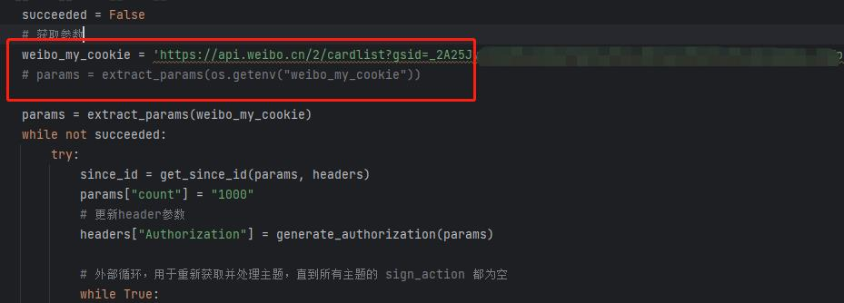

# 微博超话一键签到

20240726 新增，发微博，和status一致，也用的这个cookies,同时新增WEIBO_CONTENT 环境变量，写入发送微博的内容
20240719分析，得到分页问题status版本，有一个since_id参数，1_1代表第一页，2_1代表第二页，(并且_后面的参数不影响，所以只要-前面的数更新就能起到翻页效果)

通过分析得知,cardlist中c,s,gsid,from,containerid为必须参数，count可以控制每页数量多页以后会出一个since_id,包含三个参数，其中有page，但是第一页是没有这个参数的。

使用 Python 编写的微博超话一键签到。

---
# 更新
## 2024-07-20 更新：新增chaohua_sign.py，修改了原来的weibo_chaohua_sign.py
## 2023-08-14 更新：新增获取用户名,新增multi_user_weibo_sign.py，支持多用户，使用方法是之前环境变量‘weibo_my_cookie’用';'隔开多用户(弃用)
## 2023-08-09 更新：新增推送功能
### 如何使用
1. 本地使用，QQ邮箱推送
   - 修改以下参数：
     - 'SMTP_SERVER': 'smtp.qq.com:465'
     - 'SMTP_SSL': 'true'
     - 'SMTP_EMAIL': '自己的QQ邮箱'
     - 'SMTP_PASSWORD': '授权码'
     - 'SMTP_NAME': '随意填'  # SMTP 收发件人姓名，可随意填写
2. 本地使用，server酱推送
   - 修改以下参数：
     - 'PUSH_KEY': '',  # server 酱的 PUSH_KEY，兼容旧版与 Turbo 版
3. 青龙面板使用
   - 修改配置文件的对应位置，具体可以查看[青龙面板文档](https://github.com/whyour/qinglong)，或向我提问。

## 获取链接

首先，打开 APP，使用抓包工具获取链接。
第一种：cardlist链接方式：
1. 打开 APP

   

2. 运行抓包软件。我这边用的是 storm Sniffer，搜索 cardlist，找到我框中的这个，打开。

   

3. 复制这个以 `https[:]//api.weibo.cn/2/cardlist` 开头的链接。

   

第二种：status链接方式：
1. 打开 APP
   
   
   
2. 运行抓包软件。我这边用的是 storm Sniffer，搜索 status，找到我框中的这个，(任意一个都可以)打开。
   
   
   
4. 复制这个以 `https[:]//api.weibo.cn/2/statuses` 开头的链接。
   

5. 运行结果
   
   
---

## 环境要求

- Docker
- 青龙面板
- Python

---

## 如何使用

提供了两种方式来使用这个项目：一种是在本地运行，另一种是通过青龙面板。

### 方式一：在本地运行

1. **复制代码**：
   - 把仓库中的weibo_chaohua_sign.py内容全部复制，或者直接下载下来。

2. **修改代码**：
   
   - 
   - 首先新增一个变量weibo_my_cookie，值为之前抓包得到的 `https[:]//api.weibo.cn/2/cardlist` 开头的链接。
   - 找到最后面params = extract_params(os.getenv("weibo_my_cookie"))这一行注释掉
   - 把# params = extract_params(weibo_my_cookie)这里的注释去掉
   - 运行

### 方式二：使用青龙面板

-安装 [青龙面板](https://github.com/whyour/qinglong)。
-确保已经安装并打开了 [青龙面板](http://localhost:5700/)。

**步骤如下：**

1. **依赖管理**：
   - 选择 `python3`。
   - 点击右上角 "新建依赖"，名称填 `requests`。

2. **添加脚本**：
   - 选择 "脚本管理"，点击右上角 "+" 按钮。
   - 类型选择 "空文件"，文件名自定义，如：`weibo_sign.py`。注意后缀必须添加。
   - 点击确定完成新建。

3. **添加代码**：
   - 点击左侧 `weibo_sign.py`，点击右上角编辑按钮。
   - 将仓库中的 `weibo_chaohua_sign.py` 文件中的内容全部复制过来，然后点击保存。

4. **环境变量**：
   - 点击左侧环境变量，点击右上角新建变量。
   - 名称填 `weibo_my_cookie`，值填第一步抓包到的地址（`https://api.weibo.cn/2/cardlist?`开头的）。

5. **定时任务**：
   - 点击 "定时任务"，点击右上角新建任务，名称自定义。
   - 命令/脚本，填写刚才的文件，即：`weibo_chaohua_sign.py`。
   - 定时规则根据自己需求，可以百度查看相关规则。例如：`0 10 21 * * ?` 代表每天晚上9点10分执行。

6. **测试**：
   - 点击 "定时任务" 找到添加好的任务，点击操作下面的第一个按钮，运行测试。

   

