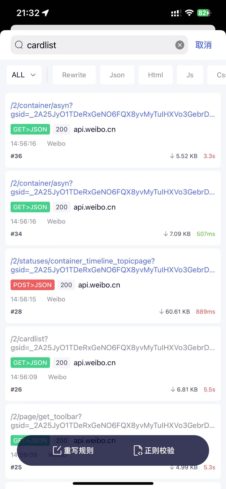
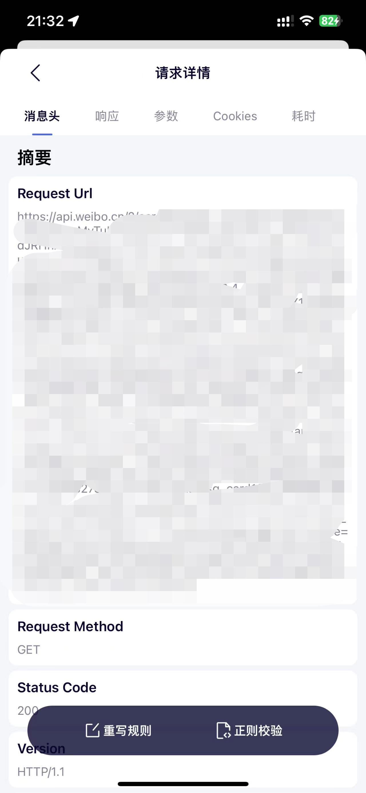

# 微博超话一键签到

用python编辑的微博超话一键签到

1、首先打开APP,用抓包工具获取到链接</n>

  1.1、打开APP  </n>
  1.2 、运行抓包软件,我这边用的是storm Sniffer,搜索cardlist，找到我框中的这个，打开 </n>
  1.3 、复制这个链接,https://api.weibo.cn/2/cardlist?'开头的 </n>
2、安装[青龙面板](https://github.com/whyour/qinglong)</n>
## 环境要求

- 要求1：Docker
- 要求2：青龙面板
- 要求3：Python

## 如何使用

打开装好的[青龙面板](http://localhost:5700/)(http://localhost:5700/) 
1.依赖管理 
选择 python3, 点击右上角 新建依赖, 名称填 requests
2.添加脚本
选择 脚本管理, 点击右上角 + 按钮, 类型 空文件, 文件名自定义即可，如:weibo_sign.py，注意后缀必须添加。点击确定完成新建。
3.添加代码
点击左侧 weibo_sign.py, 点击右上角编辑按钮，将仓库中的 weibo_chaohua_sign.py 文件中的内容全部复制过来，然后点击保存
4.环境变量
点击左侧环境变量, 点击右上角新建变量，名称填 weibo_my_cookie 值填第一步抓包到的地址('https://api.weibo.cn/2/cardlist?'开头的)
5.定时任务
点击 定时任务， 点击右上角新建任务，名称自定义即可，命令/脚本，填写刚才的文件，即:weibo_chaohua_sign.py,定时规则 这个根据自己需求，可以百度查看相关规则，比如:0 10 21 * * ?  代表队就是每天晚上9但10分执行
6.测试
点击 定时任务找到添加好的任务，点击操作下面的第一个按钮，运行测试

## 许可证

这里是关于您项目的许可
